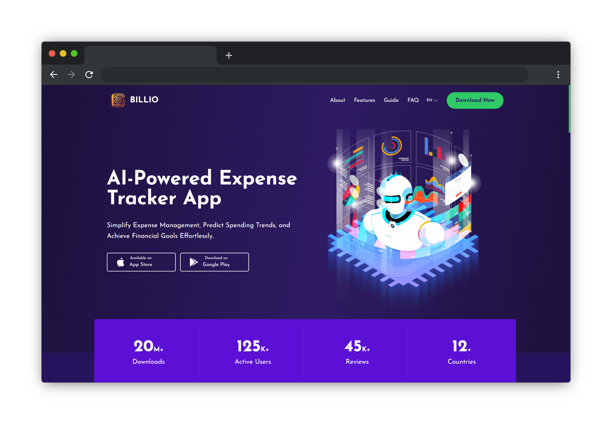

# App Landing Website

## Visit [Billio - AI-Powered Expense Tracker App](https://billio-app.onrender.com/) 🚀

## Technologies

- [React](https://reactjs.org/)
- [TypeScript](https://www.typescriptlang.org/)
- [Tailwind CSS](https://tailwindcss.com/)
- [Framer Motion](https://www.framer.com/motion/)
- [Vite](https://vitejs.dev/)
- [Shadcn UI](https://shadcn-ui.com/)

## Features

- **Mobile-first:** The website is designed for mobile devices first, and then scaled up to larger screens.
- **Responsive:** The website is fully responsive and looks great on all screen sizes.
- **Animations:** The website uses Framer Motion to add subtle animations to the UI.
- **Accessibility:** The website is fully accessible and can be navigated using only the keyboard.
- **SEO:** The website is optimized for search engines and social media platforms.

## Installation

1. Clone the project: `git clone -b billio-landing git@github.com:IndieCoderMM/dev-hub.git billio-landing`
2. Navigate to the project folder: `cd billio-landing`
3. Install dependencies: `npm install`
4. Start the development server: `npm run dev`

## Contributing

We welcome contributions from the community! If you'd like to contribute to the project, please follow these steps:

1. Fork the repository.
2. Create a new branch for your feature or bug fix: `git checkout -b feature-name`
3. Make your changes and commit them: `git commit -m 'Add some feature'`
4. Push to the branch: `git push origin feature-name`
5. Open a pull request.

## Contact

If you have any questions, feedback, or just want to say hello, feel free to reach out!

- Email: hthant00chk@gmail.com
- LinkedIn: [hthantoo](https://www.linkedin.com/in/hthantoo/)
- GitHub: [IndieCoderMM](https://github.com/indiecodermm)
- Website: [heinthantoo.me](https://heinthantoo.me/)

## License

This project is licensed under the [MIT License](LICENSE). Feel free to use the source code in any way you want. Attribution is appreciated but not required.
